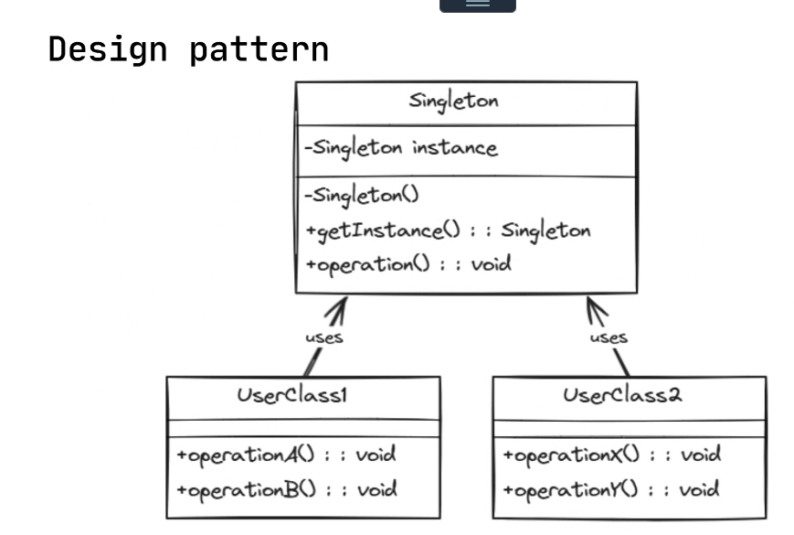

## Singleton

### Quando usarlo

-Gestione accesso a una risosrsa codivisa es:
-Configurazione, log, pool di connessioni.

Il Singleton garantisce che una classe abbia una unica istanza e un unico punto di accesso globale.

### Vantaggi

- Controllo cetralizzato dell'istanza
- Risparmio di memoria/risorse
- Accesso thread-safe all'oggetto, se implementato correttamente.

---

## Struttra di una classe Singleton(Singola instanza "autogenerata")

Singleton : la classe che mantiene il riferimento dell'unica istanza
Istanza : proprieta stati che rappresentara l'oggetto
MetodoGet : per l'instanza :: Singleton
metodi logici():: void

