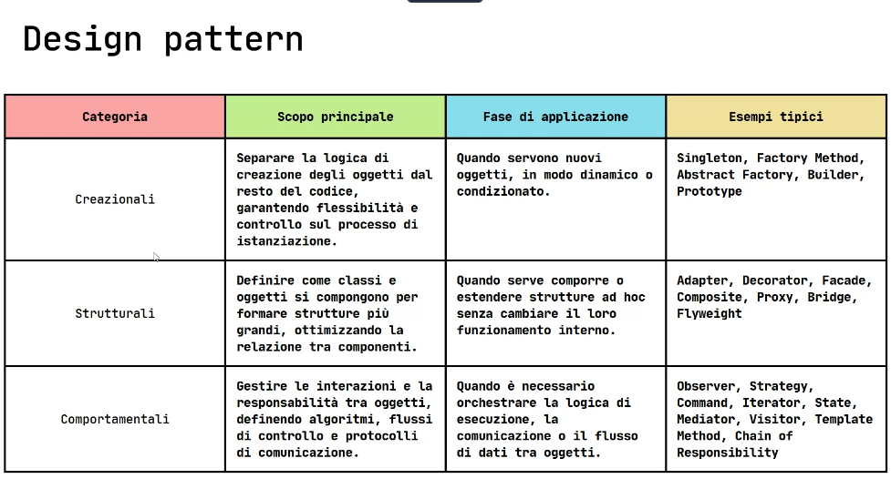

# Design Pattern (Struttura comprensibile)

I Design Patterns sono soluzioni collaudate e riutilizzabili a problemi comuni che emergono durante la progettazione e lo sviluppo del software. Immaginali come ricette per affrontare sfide di design ricorrenti, fornendo un linguaggio condiviso e un approccio standardizzato.

## Cosa Sono Esattamente?

Lontani dall'essere semplici frammenti di codice "copia-incolla", i Design Patterns sono schemi concettuali. Descrivono le relazioni, i ruoli e le responsabilità tra gli oggetti all'interno di un sistema software. Definiscono interfacce chiare e promuovono collaborazioni efficaci tra le diverse parti del tuo codice.

L'obiettivo principale dei Design Patterns è standardizzare le logiche e i processi di programmazione in Java (e in altri linguaggi orientati agli oggetti), offrendo un vocabolario comune per i progettisti e gli sviluppatori.

## Perché Usarli? I Benefici Chiave

Adottare i Design Patterns porta a numerosi vantaggi concreti nel ciclo di vita del software:

- Migliore Manutenibilità: Permettono di apportare modifiche in modo mirato e sicuro. Le logiche sono ben separate, riducendo il rischio che una modifica in un'area influenzi inaspettatamente altre parti del sistema.

- Maggiore Flessibilità: Rendono il codice più adattabile ai cambiamenti. Quando i requisiti evolvono, i pattern offrono strutture che possono essere estese o modificate con meno sforzo.

- Aumento della Leggibilità: Forniscono una struttura riconoscibile. Gli sviluppatori che conoscono i pattern possono comprendere più rapidamente le intenzioni di progettazione dietro un codebase, facilitando la collaborazione e l'onboarding di nuovi membri del team.

- Scalabilità e Estendibilità: Favoriscono la crescita del sistema. È più semplice aggiungere nuove funzionalità o estendere quelle esistenti senza dover riscrivere ampie porzioni di codice, rendendo il software pronto per il futuro.

- Soluzioni Collaudate: Utilizzi approcci che hanno dimostrato la loro efficacia nel tempo e in numerosi contesti reali, riducendo il rischio di errori di progettazione comuni.

## Origini dei Design Patterns

I Design Patterns hanno consolidato la loro fama e la loro diffusione grazie a un testo fondamentale: il libro del 1994 intitolato "Design Patterns: Elements of Reusable Object-Oriented Software".

Questo volume è stato scritto da quattro autori d'eccezione – Erich Gamma, Richard Helm, Ralph Johnson e John Vlissides – che sono passati alla storia della programmazione come la "Gang of Four" (GoF).

La loro opera ha rappresentato un punto di svolta. La GoF ha svolto un lavoro pionieristico, raccogliendo e codificando le migliori pratiche e le soluzioni architetturali più efficaci che erano emerse spontaneamente nelle comunità di sviluppatori che lavoravano con linguaggi orientati agli oggetti come C++ e Smalltalk.

Hanno fornito la prima tassonomia strutturata di questi schemi, catalogando 23 pattern distinti e suddividendoli in tre categorie principali:

- Pattern Creazionali: Si occupano della creazione di oggetti, nascondendo la logica di instanziazione e rendendo il sistema indipendente da come gli oggetti vengono creati, composti e rappresentati.

## In sintesi (Creazionali) : come creo gli oggetti?

- Singleton
- Factory Method
- Abstract Factory
- Builder
- Prototype

- Pattern Strutturali: Riguardano la composizione di classi e oggetti, per formare strutture più grandi e complesse, mantenendo le strutture flessibili ed efficienti.

## In sintesi (Strutturali) : come li lego insieme?

- Adapter
- Decorrator
- Facade
- Composite
- Proxy
- Bridge
- Flyweight

- Pattern Comportamentali: Descrivono come le classi e gli oggetti interagiscono e distribuiscono le responsabilità. Si concentrano sulla comunicazione e l'algoritmo tra gli oggetti.

## In sintesi (Comportamentali) : come interagiscono tra loro, comunicano e collaborano??

- Observer
- Strategy
- Command
- Iterator
- State
- Mediator
- Visitor
- Template Merhod
- Chain of Responsibility

## Rischi pattern :

- Sopra ingegnerizzazione(Rendere complesso qualcosa di semplice)

## Vantaggi dei pattern :

- Semplificazione logiche base complesse senza l'utilizzo dei pattern

## Pattern più utilizzati :

---

### Singleton(Creazionale)-> singolo oggetto

### Factory Method(Creazionale) -> infiti oggetti

### Abstract Factory(Creazionale)

### Builder(Creazionale)

### Prototype(Creazionale)

---

### Adapter(Strutturale):

## //aggiungi mancanti

### Observer(Comportamentale):

//aggiungi mancanti

---

## i pattern Comportamentali:

- gestiscono il flusso di controlle e le integrazioni tra oggetti
- definiscono ruoli e responsabilita
- consentono di variare algoritmi
- gestiscono protocolli di comunicazione in modo flessibile separando chiaramente chi fa cosa e agevolando l'estensione a nuovi comportamenti

---

## Progettazione Software

1. Creazionali
2. Strutturali
3. Comportamentali
